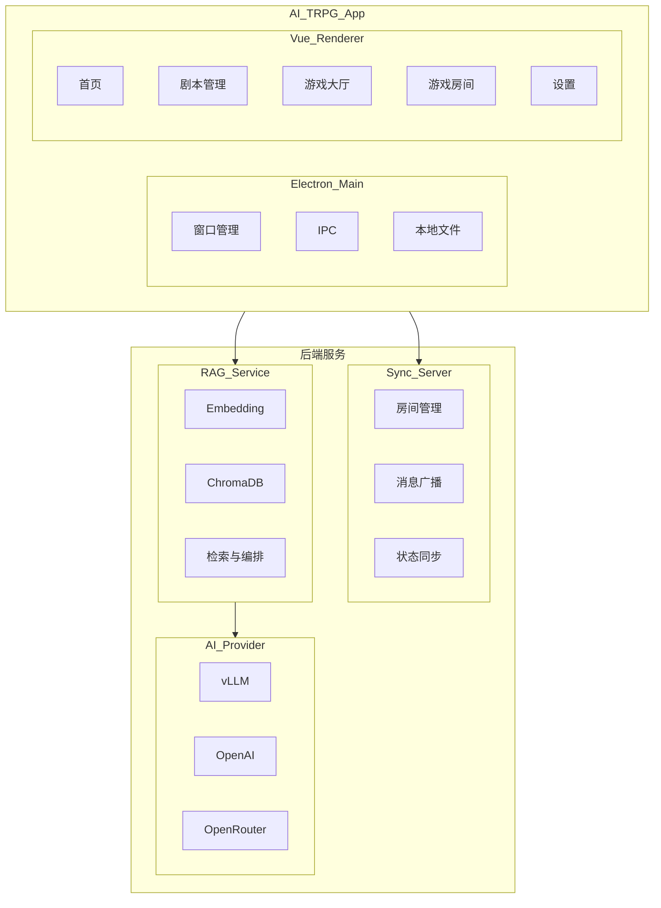
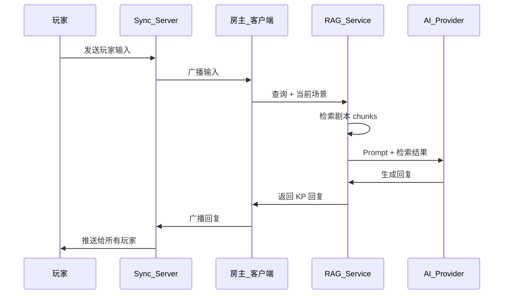
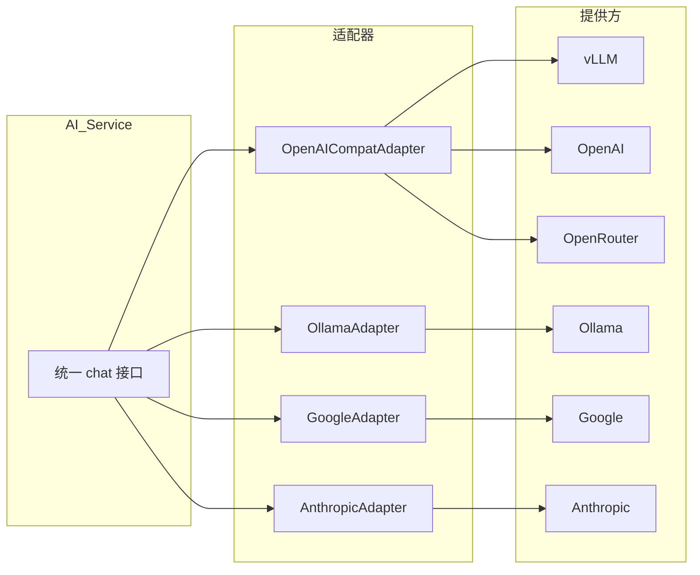

# AI TRPG APP 详细项目计划

## 一、项目概述

### 1.1 项目目标

构建一款跨平台的 AI TRPG 应用，基于 COC（克苏鲁的呼唤）与 D&D（龙与地下城）规则，具备：

- **AI KP/DM**：AI 根据完整剧本担任守密人/主持人
- **RAG 系统**：检索增强生成，保证 AI 回复准确
- **多人联机**：支持 2–6 人共同游玩
- **多 AI 源**：本地（vLLM/Ollama）+ 云端（OpenAI/Google/Anthropic/OpenRouter）
- **跨平台**：桌面端（Electron）+ 移动端（Capacitor 可选）

### 1.2 核心用户场景

| 场景 | 描述 |
|------|------|
| 单人游戏 | 玩家 vs AI KP，剧本驱动 |
| 多人游戏 | 2–6 人共享房间，AI 主持，实时同步 |
| 剧本导入 | 用户导入/创建剧本，系统解析并建立 RAG 索引 |
| 云端/本地 AI | 用户选择本地模型或云端 API（含自填 API Key） |

---

## 二、技术栈

### 2.1 前端

| 技术 | 版本 | 用途 |
|------|------|------|
| Vue | 3.x | 框架 |
| Vite | 5.x | 构建 |
| TypeScript | 5.x | 类型 |
| Pinia | 2.x | 状态管理 |
| Vue Router | 4.x | 路由 |
| Tailwind CSS | 3.x | 样式 |
| Axios | 1.x | HTTP 客户端 |
| OpenAI | 4.x | AI 调用（vLLM/OpenAI/OpenRouter） |

### 2.2 桌面端

| 技术 | 版本 | 用途 |
|------|------|------|
| Electron | 28.x | 桌面壳 |

### 2.3 后端/服务

| 技术 | 版本 | 用途 |
|------|------|------|
| Node.js | 20 LTS | 同步服务运行时 |
| Socket.io | 4.x | 多人实时通信 |
| Python | 3.10+ | RAG 服务 |
| FastAPI | 0.100+ | RAG 服务 API |
| ChromaDB | 0.4+ | 向量存储 |
| BAAI/bge-m3 | - | Embedding 模型 |
| vLLM | 0.4+ | 本地 LLM（主） |
| Ollama | 1.x | 本地 LLM（备） |

### 2.4 开发与工具

| 技术 | 用途 |
|------|------|
| ESLint | 代码检查 |
| Prettier | 格式化 |
| electron-builder | Electron 打包 |
| Vitest | 单元测试 |
| Playwright | E2E 测试（可选） |

---

## 三、系统架构

### 3.1 总体架构



### 3.2 数据流



### 3.3 AI Provider 抽象



---

## 四、功能分解

### 4.1 功能模块清单

| 模块 | 子功能 | 优先级 |
|------|--------|--------|
| F1 基础框架 | 项目初始化、Electron 集成、响应式布局、路由 | P0 |
| F2 剧本系统 | 剧本 Schema、解析、导入、RAG 索引 | P0 |
| F3 AI 调用 | Provider 适配器、统一接口、流式输出 | P0 |
| F4 RAG 服务 | Embedding、ChromaDB、检索、Prompt 构建 | P0 |
| F5 游戏核心 | 对话 UI、骰子、角色卡、场景切换 | P0 |
| F6 存档系统 | 保存、加载、自动保存 | P0 |
| F7 多人联机 | 房间、加入/离开、消息广播、状态同步 | P0 |
| F8 规则引擎 | COC/D&D 骰子、判定、技能计算 | P0 |
| F9 设置 | AI Provider、API Key、RAG、同步服务配置 | P0 |
| F10 打包发布 | Electron 打包、安装程序 | P1 |
| F11 移动端 | Capacitor 打包 | P2 |

---

## 五、开发阶段与任务

### 阶段一：基础框架（约 3 周）

| 周 | 任务 | 子任务 | 产出 |
|----|------|--------|------|
| 1 | 项目初始化 | 创建 Vite + Vue 3 + TS 项目 | 可运行的前端 |
| | | 配置 Tailwind、ESLint、Prettier | |
| | | 配置 Electron（main/preload） | 可运行的 Electron |
| | | 实现开发/生产环境切换 | |
| 2 | 布局与路由 | 设计桌面/移动响应式布局 | 多分辨率适配 |
| | | 实现侧边栏/底部导航切换 | |
| | | 配置 Vue Router，定义主要路由 | |
| | | 实现空占位页面 | |
| 3 | 状态与 IPC | 创建 Pinia stores 骨架 | stores 可用 |
| | | 实现 Electron IPC 桥接 | preload + handlers |
| | | 实现设置持久化（electron-store） | 设置可保存 |

### 阶段二：剧本系统（约 3 周）

| 周 | 任务 | 子任务 | 产出 |
|----|------|--------|------|
| 1 | 剧本 Schema | 定义 COC 剧本 JSON Schema | schema 文件 |
| | | 定义 D&D 剧本 JSON Schema | |
| | | 定义场景、NPC、线索、判定、分支结构 | |
| 2 | 剧本解析 | 实现剧本解析器 | scriptParser |
| | | 实现 chunk 切分策略 | |
| | | 输出供 RAG 使用的 chunks | |
| 3 | 剧本管理 UI | 剧本列表、导入、删除 | 剧本管理页面 |
| | | 剧本详情预览 | |
| | | 通过 IPC 读写本地剧本文件 | |

### 阶段三：AI 调用层（约 2 周）

| 周 | 任务 | 子任务 | 产出 |
|----|------|--------|------|
| 1 | Provider 适配器 | OpenAICompatAdapter（vLLM/OpenAI/OpenRouter） | adapters |
| | | OllamaAdapter | |
| | | GoogleAdapter（fetch） | |
| | | AnthropicAdapter（fetch） | |
| 2 | AI Service | 统一 chat 接口 | aiService |
| | | 根据配置选择 adapter | |
| | | 流式输出与错误处理 | |
| | | API Key 安全存储 | |

### 阶段四：RAG 服务（约 3 周）

| 周 | 任务 | 子任务 | 产出 |
|----|------|--------|------|
| 1 | RAG 基础 | Python 项目、FastAPI 入口 | rag-service |
| | | 集成 bge-m3 或替代 embedding | |
| | | ChromaDB 初始化与集合管理 | |
| 2 | 索引构建 | 接收剧本 chunks | indexer |
| | | 向量化并写入 ChromaDB | |
| | | metadata 过滤（scene_id, type 等） | |
| 3 | 检索与编排 | 检索接口：query + filters | retriever |
| | | 多路召回、重排序（可选） | |
| | | Prompt 构建：system + 检索结果 + 对话 | |
| | | 调用 LLM 并返回 | |

### 阶段五：游戏核心（约 4 周）

| 周 | 任务 | 子任务 | 产出 |
|----|------|--------|------|
| 1 | 对话 UI | 消息列表、气泡样式 | 对话界面 |
| | | KP/玩家/系统消息区分 | |
| | | 流式打字效果 | |
| | | 输入框、发送 | |
| 2 | 骰子系统 | COC d100、成功/失败/大成功/大失败 | diceService |
| | | D&D d20、d4/d6/d8/d10/d12 | |
| | | 骰子动画 UI | |
| | | AI 判定触发与结果回传 | |
| 3 | 角色卡 | COC 角色卡结构 | 角色卡 UI |
| | | D&D 角色卡结构 | |
| | | 编辑与自动更新（HP、技能等） | |
| 4 | 场景与剧情 | 场景切换逻辑 | 剧情推进 |
| | | 与 RAG 检索联动 | |
| | | 线索/物品展示 | |

### 阶段六：存档系统（约 1 周）

| 任务 | 子任务 | 产出 |
|------|--------|------|
| 存档 | 定义存档结构（对话、角色、场景、房间） | saveService |
| | 保存到本地文件（IPC） | |
| | 自动保存间隔 | |
| 读档 | 加载存档、恢复状态 | |
| | 重建 RAG 上下文（可选） | |

### 阶段七：多人联机（约 3 周）

| 周 | 任务 | 子任务 | 产出 |
|----|------|--------|------|
| 1 | 同步服务 | Node.js + Socket.io 项目 | sync-server |
| | | 房间创建/加入/离开 | |
| | | 消息广播（chat、dice、scene） | |
| 2 | 客户端集成 | syncService 封装 | syncService |
| | | 房主/玩家角色区分 | |
| | | 重连、断线提示 | |
| 3 | 状态同步 | 角色卡、骰子、场景、回合同步 | |
| | | 冲突处理（以房主为准） | |
| | | 多人游戏流程联调 | |

### 阶段八：规则引擎（约 2 周）

| 周 | 任务 | 子任务 | 产出 |
|----|------|--------|------|
| 1 | COC 规则 | 技能判定、属性判定 | cocRules |
| | | 大成功/大失败、抵抗表 | |
| | | 伤害、San 值计算 | |
| 2 | D&D 规则 | AC、攻击、豁免 | dndRules |
| | | 技能检定、优势/劣势 | |
| | | 简易战斗轮次 | |

### 阶段九：设置与集成（约 2 周）

| 周 | 任务 | 子任务 | 产出 |
|----|------|--------|------|
| 1 | 设置 UI | AI Provider 选择、baseUrl、apiKey、model | 设置页面 |
| | | RAG 服务 URL、开关 | |
| | | 同步服务 URL（局域网/公网） | |
| 2 | 集成与联调 | 端到端流程测试 | |
| | | 单人 + 多人 + RAG + 多 Provider 联调 | |

### 阶段十：打包与发布（约 1 周）

| 任务 | 子任务 | 产出 |
|------|--------|------|
| 打包 | electron-builder 配置 | 可分发安装包 |
| | Windows exe / macOS dmg / Linux AppImage | |
| 文档 | 用户说明、部署说明、开发说明 | README/docs |

---

## 六、目录结构

```
AI TRPG APP/
├── electron/
│   ├── main.ts
│   ├── preload.ts
│   └── ipc/
│       ├── fileHandlers.ts
│       ├── settingsHandlers.ts
│       └── index.ts
│
├── src/
│   ├── main.ts
│   ├── App.vue
│   ├── components/
│   │   ├── common/
│   │   ├── game/
│   │   │   ├── ChatMessage.vue
│   │   │   ├── DiceRoller.vue
│   │   │   ├── CharacterSheet.vue
│   │   │   └── SceneView.vue
│   │   └── layout/
│   ├── views/
│   │   ├── HomeView.vue
│   │   ├── ScriptListView.vue
│   │   ├── ScriptDetailView.vue
│   │   ├── LobbyView.vue
│   │   ├── GameRoomView.vue
│   │   └── SettingsView.vue
│   ├── stores/
│   │   ├── gameStore.ts
│   │   ├── roomStore.ts
│   │   ├── scriptStore.ts
│   │   └── settingsStore.ts
│   ├── services/
│   │   ├── ai/
│   │   │   ├── aiService.ts
│   │   │   ├── types.ts
│   │   │   └── adapters/
│   │   │       ├── base.ts
│   │   │       ├── openaiCompat.ts
│   │   │       ├── ollama.ts
│   │   │       ├── google.ts
│   │   │   └── anthropic.ts
│   │   ├── ragService.ts
│   │   ├── syncService.ts
│   │   ├── scriptService.ts
│   │   ├── diceService.ts
│   │   └── saveService.ts
│   ├── types/
│   │   ├── script.ts
│   │   ├── game.ts
│   │   └── api.ts
│   ├── router/
│   └── composables/
│
├── server/
│   ├── src/
│   │   ├── index.ts
│   │   ├── roomManager.ts
│   │   ├── socketHandlers.ts
│   │   └── types.ts
│   └── package.json
│
├── rag-service/
│   ├── main.py
│   ├── embedding.py
│   ├── retriever.py
│   ├── indexer.py
│   ├── prompt_builder.py
│   ├── requirements.txt
│   └── config.py
│
├── schemas/
│   ├── coc-script.schema.json
│   └── dnd-script.schema.json
│
├── scripts/
│   ├── coc/
│   └── dnd/
│
├── package.json
├── vite.config.ts
├── electron-builder.json
└── tsconfig.json
```

---

## 七、数据模型

### 7.1 剧本 Schema 概要（COC）

```json
{
  "meta": {
    "title": "剧本名",
    "author": "作者",
    "ruleSystem": "coc",
    "version": "1.0"
  },
  "scenes": [
    {
      "id": "scene_001",
      "name": "场景名",
      "description": "场景描述",
      "npcIds": ["npc_001"],
      "clueIds": ["clue_001"],
      "transitionCondition": "..."
    }
  ],
  "npcs": [
    {
      "id": "npc_001",
      "name": "NPC 名",
      "description": "外貌、性格",
      "dialogueStyle": "台词风格"
    }
  ],
  "clues": [
    {
      "id": "clue_001",
      "description": "线索描述",
      "obtainCondition": "获得条件"
    }
  ],
  "checks": [
    {
      "id": "check_001",
      "skill": "图书馆使用",
      "difficulty": "普通",
      "successSceneId": "...",
      "failSceneId": "..."
    }
  ]
}
```

### 7.2 游戏状态

```typescript
interface GameState {
  sessionId: string;
  scriptId: string;
  currentSceneId: string;
  messages: Message[];
  characters: Record<string, Character>;
  cluesObtained: string[];
  turnOrder?: string[];
  round?: number;
}
```

### 7.3 消息类型

```typescript
type Message =
  | { type: 'kp'; content: string; isStreaming?: boolean }
  | { type: 'player'; playerId: string; playerName: string; content: string }
  | { type: 'dice'; playerId: string; result: DiceResult; skill?: string }
  | { type: 'system'; content: string };
```

---

## 八、API 设计

### 8.1 RAG 服务 API

| 方法 | 路径 | 说明 |
|------|------|------|
| POST | /index | 提交剧本 chunks，建立索引 |
| POST | /query | 检索 + 生成：query, sceneId, messages 返回 response |
| DELETE | /index/{scriptId} | 删除某剧本索引 |
| GET | /health | 健康检查 |

### 8.2 同步服务事件（Socket.io）

| 事件 | 方向 | 说明 |
|------|------|------|
| create-room | C 到 S | 创建房间 |
| join-room | C 到 S | 加入房间 |
| leave-room | C 到 S | 离开房间 |
| chat-message | C 到 S | 发送聊天 |
| dice-roll | C 到 S | 投骰 |
| game-state | S 到 C | 游戏状态同步 |
| kp-message | S 到 C | KP 消息广播 |

### 8.3 Electron IPC

| Channel | 说明 |
|---------|------|
| file:readScript | 读取剧本文件 |
| file:saveScript | 保存剧本 |
| file:listScripts | 列举剧本目录 |
| save:write | 写存档 |
| save:read | 读存档 |
| save:list | 列举存档 |
| settings:get | 获取设置 |
| settings:set | 保存设置 |

---

## 九、时间线

| 阶段 | 内容 | 周数 | 累计 |
|------|------|------|------|
| 1 | 基础框架 | 3 | 3 |
| 2 | 剧本系统 | 3 | 6 |
| 3 | AI 调用层 | 2 | 8 |
| 4 | RAG 服务 | 3 | 11 |
| 5 | 游戏核心 | 4 | 15 |
| 6 | 存档系统 | 1 | 16 |
| 7 | 多人联机 | 3 | 19 |
| 8 | 规则引擎 | 2 | 21 |
| 9 | 设置与集成 | 2 | 23 |
| 10 | 打包发布 | 1 | 24 |

**总工期**：约 24 周（约 6 个月）

---

## 十、风险与应对

| 风险 | 概率 | 影响 | 应对 |
|------|------|------|------|
| vLLM 显存不足 | 中 | 高 | 提供 Ollama 备选，支持云端 API |
| RAG 检索不准 | 中 | 中 | 调 chunk 策略、metadata 过滤、重排序 |
| 多人延迟 | 低 | 中 | 优化消息量，必要时做消息合并 |
| 剧本格式碎片化 | 中 | 中 | 先定 Schema，提供转换工具 |
| Electron 包体积大 | 低 | 低 | 按需排除依赖，考虑 Tauri 替代 |

---

## 十一、测试策略

| 类型 | 范围 | 工具 |
|------|------|------|
| 单元测试 | services、stores、utils | Vitest |
| 组件测试 | 核心 UI 组件 | Vitest + Vue Test Utils |
| 集成测试 | AI 调用、RAG 检索 | 手动/脚本 |
| E2E 测试 | 关键流程 | Playwright |
| 多人测试 | 房间、同步 | 多实例 + 手动 |

---

## 十二、里程碑检查点

| 里程碑 | 验收标准 |
|--------|----------|
| M1 | Electron + Vue 可启动，布局响应式，路由可用 |
| M2 | 剧本可导入、解析，RAG 索引可建立 |
| M3 | AI 可通过 vLLM/OpenAI 等输出，流式显示 |
| M4 | RAG 检索可影响 AI 回复内容 |
| M5 | 单人可完整游玩一局（对话 + 骰子 + 角色卡） |
| M6 | 多人可进入同一房间并同步对话与骰子 |
| M7 | 存档可保存与加载 |
| M8 | 可打包为 Windows/macOS 安装包 |
