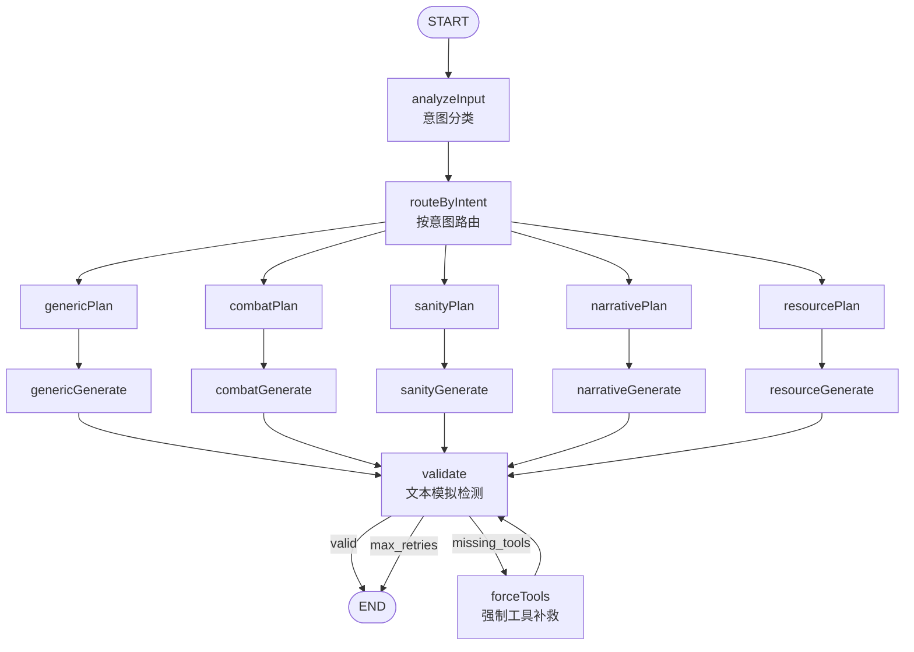

# COC 7th AI KP — 克苏鲁的呼唤 AI 守秘人

基于 **Vue 3 + Electron** 的单机 COC 7th 跑团应用，由 AI 扮演守秘人（KP），通过工具调用执行投骰与规则判定，结合 RAG 从剧本中检索故事情报，实现可追溯、规则严谨的 AI 跑团体验。

---

## 项目结构

本仓库以 `ai-trpg-web` 为主应用目录。以下结构展示各模块在仓库中的位置与职责：

```
AI-COC-KP/
├── README.md
├── PROJECT_PLAN.md
│
└── ai-trpg-web/                    # 主应用（Vue 3 + Electron）
    ├── src/                        # 前端源码（Vue 渲染进程）
    │   ├── components/             # 可复用组件
    │   │   ├── game/               # 游戏相关：ChatMessage, PlayerStatsBar
    │   │   ├── layout/             # 布局：AppLayout
    │   │   └── ui/                 # 通用 UI：ToastContainer
    │   ├── composables/            # 组合式函数：useToast
    │   ├── data/                   # 静态数据：coc7.ts（职业、技能、时代标签）
    │   ├── logic/                  # COC 规则逻辑（纯函数，无 UI）
    │   │   ├── coc7Rules.ts        # 技能检定阈值、成功等级、对抗判定
    │   │   ├── coc7Character.ts    # 角色创建、伤害加值/体格、HP/MP/SAN 公式
    │   │   ├── healingRules.ts     # 自然恢复（轻伤每日+1、重伤每周 CON 检定）
    │   │   ├── growthRules.ts      # 幕间成长占位（Sprint 2）
    │   │   ├── environmentRules.ts # 环境伤害占位（Sprint 2）
    │   │   └── __tests__/          # 规则单元测试
    │   ├── services/               # 业务服务层
    │   │   ├── ai/                 # AI 调用：aiService, modelListService
    │   │   ├── kpPromptService.ts  # KP system prompt 构建
    │   │   ├── kpSessionService.ts # KP 会话循环、工具链迭代
    │   │   ├── memoryService.ts    # 长期摘要、storyContext 注入
    │   │   ├── saveService.ts      # 存档序列化、版本迁移
    │   │   ├── ragService.ts       # RAG 检索（调用 Electron IPC）
    │   │   ├── storyService.ts     # 故事分块、Markdown 结构化
    │   │   ├── diceService.ts      # 骰子范围、cocResult 大成功/大失败
    │   │   ├── toolContextFactory.ts  # ToolHandlerContext 构造
    │   │   └── __tests__/
    │   ├── stores/                 # Pinia 状态
    │   │   ├── gameStore.ts        # 游戏主状态、消息、角色、记忆、存档
    │   │   ├── settingsStore.ts   # AI/RAG 配置
    │   │   ├── storyStore.ts       # 故事列表、索引
    │   │   └── __tests__/
    │   ├── toolCalling/            # 工具编排与 handler
    │   │   ├── orchestrator.ts     # 路由工具到 handler、聚合结果
    │   │   ├── types.ts            # ToolHandler, ToolHandlerContext, *Result 类型
    │   │   ├── cocToolNames.json   # 工具名列表（由 sync-tools 生成）
    │   │   ├── handlers/           # 各领域 handler
    │   │   │   ├── checkHandler.ts     # skill_check, opposed_check
    │   │   │   ├── combatHandler.ts   # melee/ranged, adjust_hp, major_wound, first_aid, medicine
    │   │   │   ├── sanityHandler.ts    # san_check, trigger_insanity, adjust_san, reset_day
    │   │   │   ├── resourceHandler.ts # adjust_hp/mp/san, spend_luck
    │   │   │   ├── narrativeHandler.ts # transition_scene, grant_clue, roll_dice
    │   │   │   └── __tests__/
    │   │   └── __tests__/          # orchestrator, toolConsistency, mockContext
    │   ├── types/                  # 类型定义
    │   │   ├── character.ts        # COCCharacterSheet, COCAttributes, COCDerivedStats
    │   │   ├── game.ts             # Message, 游戏消息
    │   │   ├── script.ts           # 剧本类型
    │   │   └── storyContext.ts     # 注入 LangGraph 的结构化上下文
    │   ├── utils/                  # 工具函数：pathUtils
    │   ├── views/                  # 页面级组件
    │   │   ├── HomeView.vue
    │   │   ├── GameRoomView.vue
    │   │   ├── CharacterCreateView.vue
    │   │   ├── OccupationSelectView.vue
    │   │   ├── ScriptListView.vue
    │   │   └── SettingsView.vue
    │   ├── router/
    │   ├── App.vue
    │   └── main.ts
    │
    ├── electron/                   # Electron 主进程（Node 环境）
    │   ├── main.cjs                 # 主进程入口、窗口、IPC 注册
    │   ├── preload.cjs              # contextBridge 暴露 electronAPI
    │   ├── logging.cjs              # 主进程日志封装
    │   ├── agent/                   # LangGraph KP 图
    │   │   ├── kpGraph.mjs          # 意图分类、Plan/Generate、validate、forceTools
    │   │   └── __tests__/
    │   ├── rag/                     # RAG 向量检索
    │   │   ├── vectorStore.mjs      # TF-IDF、dense embedding、索引/查询
    │   │   ├── embedding.mjs        # 内置/API embedding
    │   │   └── __tests__/
    │   ├── ipc/                     # IPC handler
    │   │   ├── aiHandlers.cjs       # AI 调用、COC_KP_TOOLS 定义
    │   │   ├── kpAgentHandlers.cjs  # kp:invoke / kp:invokeStream（LangGraph）
    │   │   ├── ragHandlers.cjs      # rag:index / query / context / health
    │   │   ├── fileHandlers.cjs     # 故事/剧本读写、PDF OCR
    │   │   ├── saveHandlers.cjs     # 存档读写
    │   │   ├── settingsHandlers.cjs
    │   │   ├── pathSafety.cjs       # 路径校验、防穿越
    │   │   └── __tests__/
    │   └── integration/             # 冒烟测试：smoke.cjs
    │
    ├── scripts/                    # 构建/同步脚本
    │   ├── sync-tools.cjs           # COC_KP_TOOLS → cocToolNames.json
    │   └── __tests__/
    │
    ├── docs/                       # 项目文档
    │   ├── COC7_KP_WORKFLOW.md      # 工作流、数据流、模块边界
    │   ├── COC-KP-SPRINT-PLAN.md    # Sprint 计划
    │   ├── COC-KP-GAP-ANALYSIS.md   # 规则书差距分析
    │   ├── TESTING.md               # 测试分层、TDD 流程
    │   └── CODE-REVIEW-2026-03-06.md
    │
    ├── e2e/                        # E2E 测试（Playwright）
    │   └── electron.e2e.mjs
    │
    ├── package.json
    ├── vite.config.ts
    └── vitest.config.ts
```

---

## 功能概览

- **AI 守秘人**：LangGraph 多 Agent 工作流（意图分类 → 工具规划 → 生成 → 验证），强制通过工具调用执行投骰/HP/SAN 变更，防止叙事中伪造骰点
- **RAG 剧本检索**：支持 PDF / Markdown / TXT 导入，TF-IDF + 可选 dense embedding，PDF 内嵌图 OCR 纳入索引
- **COC 7th 规则**：技能检定、对抗检定、近战/远程攻击、重伤/濒死/即死、SAN 检定与疯狂判定、急救/医学、自然恢复、Max SAN 限制等
- **记忆与存档**：短期/长期记忆、场景切换触发摘要、完整存档/读档
- **多 LLM 支持**：OpenAI / Anthropic / Google / DeepSeek 等兼容 API

---

## 多 Agent 系统架构

KP 采用 LangGraph 实现的多阶段工作流，按玩家意图路由到不同子 Agent，每个子 Agent 负责「规划工具」与「生成叙事」，最后统一进入验证与补救环节。

### 整体流程图



### 意图类型与路由

| 意图 | 说明 | 路由到的 Agent |
|------|------|----------------|
| `investigate` | 搜索、侦查、检查、图书馆/研究 | narrative |
| `skill_check` | 明确技能检定或投骰 | generic |
| `talk_npc` | 与 NPC 对话、询问、说服 | narrative |
| `move` | 移动、前往某处 | narrative |
| `combat` | 战斗、攻击、格斗、射击、闪避 | **combat** |
| `explore` | 探索环境、观察周围 | narrative |
| `use_item` | 使用道具或物品 | **resource** |
| `san_encounter` | 目睹恐怖/超自然事件 | **sanity** |
| `narrative` | 一般叙事、角色扮演 | narrative / generic |

### 各 Agent 职责

| Agent | 职责 | 典型工具 |
|-------|------|----------|
| **combat** | 战斗场景：近战/远程、伤害、重伤/濒死 | `melee_attack`, `ranged_attack`, `apply_major_wound`, `first_aid`, `medicine` |
| **sanity** | 理智与疯狂：SAN 检定、疯狂判定、新日重置 | `san_check`, `trigger_insanity`, `adjust_san`, `reset_day` |
| **narrative** | 叙事与调查：场景、线索、技能检定 | `skill_check`, `opposed_check`, `transition_scene`, `grant_clue` |
| **resource** | 资源与物品：HP/MP/SAN/Luck 调整 | `adjust_hp`, `adjust_mp`, `spend_luck` |
| **generic** | 兜底：规则问答、简单闲聊 | 限制不主动推动剧情 |

### 验证与补救

- **validate**：检测叙事中是否出现「伪造骰子/HP/SAN/MP」等文本模拟（正则匹配），若发现则标记 `missing_tools`
- **forceTools**：当验证失败时，进入「仅允许工具调用」的补救回合，最多重试一次，避免 KP 在纯文本中编造数值

---

## 技术栈

| 层级 | 技术 |
|------|------|
| 前端 | Vue 3, Pinia, Vue Router, TypeScript, Vite, Tailwind CSS |
| 桌面 | Electron |
| AI | LangChain / LangGraph, OpenAI SDK |
| RAG | 内置 TF-IDF + Xenova/Transformers 本地 embedding 或可选 API embedding |
| 测试 | Vitest, Playwright |

---

## 快速开始

### 环境要求

- Node.js 18+
- npm 或 pnpm

### 安装与运行

```bash
# 进入主应用目录
cd ai-trpg-web

# 安装依赖
npm install

# 开发模式（Vue 开发服务器）
npm run dev

# Electron 桌面应用开发模式
npm run electron:dev

# 构建生产包
npm run electron:build
```

### 配置

首次运行需在设置中配置：

- **AI 服务**：Base URL、API Key、模型名称（支持 OpenAI 兼容接口）
- **RAG**（可选）：开启语义检索时，可选择内置 embedding 或使用自定义 embedding API

---

## 开发路线图

### Sprint 1：治疗与 Max SAN ✅ 已完成

**主题**：急救/医学、自然恢复、Max SAN 限制  
**目标**：让「受伤 → 稳定 → 恢复」与 Max SAN 规则闭环。

| 功能 | 实现状态 |
|------|----------|
| **急救 (first_aid)** | 濒死时成功急救 HP +1、`isDying`→false；满血提示无需急救 |
| **医学 (medicine)** | 成功医学检定按 1D3 治疗 HP，不超过 hpMax；失败/满血仅提示 |
| **自然恢复** | `healingRules.applyNaturalHealing`：轻伤每日 +1 HP；重伤每周 CON 检定成功 +1D3 HP |
| **Max SAN clamp** | `adjust_san` 正向变化后 clamp 到 `99 - cthulhuMythos`；负向不受限 |

---

### Sprint 2：幕间成长与环境伤害 🔲 规划中

**主题**：技能成长、环境伤害表  
**目标**：支持「一案结束后的成长」与常见环境危害。

| 功能 | 规划内容 |
|------|----------|
| **幕间成长** | `skillGrowthMarks`、`mark_skill_growth`、`development_phase`：D100 > 技能值 → +1D10；技能达 90% → +2D6 SAN |
| **环境伤害** | `environmental_damage` 辅助：坠落/火焰/溺水/毒素（Table III）；KP prompt 提供伤害表，配合 `adjust_hp` + `apply_major_wound` |

---

### Sprint 3：魔法系统与 SAN 恢复 🔲 规划中

**主题**：神话典籍、施法、SAN 恢复  
**目标**：打通「接触神话 → 典籍 → 法术 → 施法 → 代价/恢复」路径。

| 功能 | 规划内容 |
|------|----------|
| **神话典籍** | `read_tome`：泛读/精读、CM 增长、SAN 损失、法术列表；`cthulhuMythos`、`knownSpells`、`readTomes` |
| **施法检定** | `cast_spell`：首次困难 POW 检定，失败可孤注一掷；与 `adjust_mp`、`adjust_san` 联动 |
| **SAN 恢复** | `award_san`（剧本奖励）、`therapy_check`（心理治疗 D100 → +1D3 或 -1D6 SAN） |

---

### Sprint 4：追逐系统与先攻/战技 🔲 规划中

**主题**：追逐子系统 + 先攻/战技骨架  
**目标**：为高动作量剧本提供基本的追逐与战术结构。

| 功能 | 规划内容 |
|------|----------|
| **追逐** | 参与者 MOV/行动点、位置序列；初期用 `skill_check` + `transition_scene` 组合；可选 `start_chase`/`advance_chase`/`end_chase` |
| **先攻与战技** | `mov` 字段、MOV/DEX 排序；缴械/绊倒/擒抱作为 `skill_check` + `opposed_check` 模板 |

---

### Sprint 5+：经济、NPC 幸运池、习惯恐惧 🔲 规划中

**主题**：加深长期战役与高重玩性体验。

| 功能 | 规划内容 |
|------|----------|
| **信用评级** | `creditRating`/`cashOnHand`/`assets`；KP prompt 生活水平/开销对照表；可选 `adjust_credit` |
| **NPC 幸运池** | 关键 NPC Luck 池；KP 消耗 NPC Luck 调整骰点 |
| **习惯恐惧** | `horrorHabituation`；累积 SAN 损失超表值后该类型不再损失；Table IX/X 恐惧症/躁狂症随机表 |

---

## 测试

```bash
cd ai-trpg-web

# 单元/集成测试（含工具同步）
npm run test:run

# 监听模式
npm test

# Electron 冒烟测试
npm run test:electron:smoke

# E2E（Playwright + Electron）
npm run test:e2e:electron
```

测试分层与 TDD 流程见 [ai-trpg-web/docs/TESTING.md](ai-trpg-web/docs/TESTING.md)。

---

## 文档

| 文档 | 说明 |
|------|------|
| [COC7_KP_WORKFLOW.md](ai-trpg-web/docs/COC7_KP_WORKFLOW.md) | 工程能力、数据流、LangGraph 结构 |
| [COC-KP-SPRINT-PLAN.md](ai-trpg-web/docs/COC-KP-SPRINT-PLAN.md) | Sprint 计划与任务分解 |
| [COC-KP-GAP-ANALYSIS.md](ai-trpg-web/docs/COC-KP-GAP-ANALYSIS.md) | 规则书与实现差距分析 |
| [TESTING.md](ai-trpg-web/docs/TESTING.md) | 测试分层、TDD 流程、用例规划 |
| [CODE-REVIEW-2026-03-06.md](ai-trpg-web/docs/CODE-REVIEW-2026-03-06.md) | 代码审查与重构记录 |

