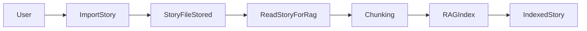
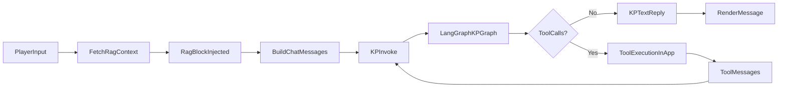
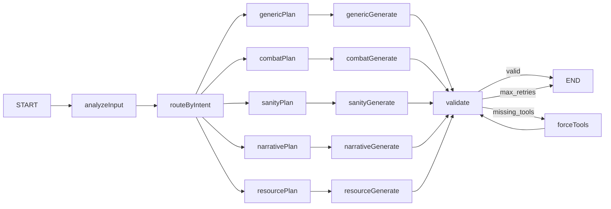

# COC7 AI KP 项目总览与工作流

本文档是对当前项目（`ai-trpg-web`）的**工程能力、核心数据流、关键模块**的整体说明，用于团队协作、排障与后续迭代设计。

---

## 1. 项目是什么

这是一个基于 **Vue 3 + Electron** 的单机（本地）COC 7th 跑团应用，核心目标是：

- 让玩家在 UI 中进行行动描述；
- 由 AI 扮演 KP（守密人），并且**必须**通过工具调用执行投骰/数值变更等规则动作；
- 通过 **RAG** 从剧本（故事文件）中检索“故事情报”来约束叙事与场景；
- 通过 **LangGraph**（多节点工作流）让 KP 回合更稳、更可控（意图分类、工具规划、验证与补救）。

---

## 2. 关键能力清单（已实现）

### 2.1 剧本/故事（Stories）

- **导入故事文件**：支持 `.pdf`、`.txt`、`.md`、`.json`（文件存放在 Electron 的用户数据目录下）。  
- **PDF 文本提取**：PDF 正文文本由解析器提取。  
- **PDF 插图信息**：用于索引时，会对 PDF 内嵌图片做 OCR，把“结构图/插图文字”并入索引文本（避免整页渲染导致与正文重复）。  
- **故事索引**：把故事内容切分为 chunks，交给内置向量检索模块建立索引。

### 2.2 RAG（故事检索）

- **索引**：每个 chunk 会保存 `id / content / type / metadata`，并建立 TF-IDF（以及可选 dense embedding）向量；若启用 GraphRAG，`graphStore.indexGraph` 会从 chunks 抽取实体/关系、社区摘要，写入 `userData/rag_graph/*.json`。  
- **检索**：游戏每回合把玩家输入当 query，通过 `rag:context` 调用 `graphRag.buildContextWithGraph`（向量检索 → 图扩展 2-hop → 结构化摘要）；若关闭 GraphRAG 则退化为纯向量检索。每轮会附加用户行动图谱摘要，作为故事情报块注入 system prompt。  
- **用户行动图谱（userGraphStore）**：记录调查员获得的线索、到访场景、检定等，存储于 `userData/session_graph/{storyId}_{sessionId}.json`；事件来源：`grant_clue`、`transition_scene`、`skill_check`、`san_check`、`melee_attack`、`ranged_attack` 等。
- **场景过滤**：检索接口支持 `sceneId` 过滤（当前实现会把当前场景传入 RAG，若 chunk 带场景元信息则可收窄结果；没有场景元信息时则相当于全局检索）。

### 2.3 KP（守密人）AI：LangGraph 工作流

- **一回合多阶段**：意图识别 → 工具规划 → 生成 → 验证 →（必要时）强制工具补救 → 结束。  
- **工具调用安全**：检测叙事里“伪造骰子/HP/SAN/MP”等文本模拟，若发现则走补救逻辑。  
- **工具链执行**：工具调用由前端/应用层执行，结果以 tool messages 反馈到下一轮 LLM 输入中，形成可追溯链路。

### 2.4 游戏状态与 storyContext（结构化上下文）

- 从前端游戏状态构建并注入 LangGraph（如：当前场景、SAN、当日 SAN 损失等），用于引导叙事与规则策略。  
- storyContext 作为结构化对象进入 LangGraph state，再被写入系统提示（仅供模型参考）。

### 2.5 记忆管理（短期 + 长期）

- **短期**：  
  - 最近 N 条玩家/KP对话（滑动窗口）进入每次调用的 messages；  
  - `kpMemory` 以“记忆块”的形式注入 system prompt，用于避免重复措辞；  
  - “最近几轮”压缩块（玩家→KP成对）作为密集短期回顾，减少对长窗口的依赖。  
- **长期**：  
  - `longTermSummary`（会话摘要）在“场景切换/定期”触发更新；  
  - 摘要生成会引入当前 storyContext（方案 A）：用“权威状态”校正对话遗漏/歧义；  
  - **新增**：长期摘要时同时注入 `ragContextText`（RAG + GraphRAG 摘要）与 `userGraphSummary`（用户图谱摘要），由 `runLongTermSummarization` 在触发前调用 `getContext` 与 `getUserGraphSummary` 获取；
  - 支持保存/读档以跨会话恢复记忆与状态；`loadGame` 时调用 `syncUserGraphFromState` 同步用户图谱。

### 2.6 存档（Save/Load）

- 支持列出存档、读档、写档；  
- 存档会包含：故事信息、当前场景、线索、对话、短期记忆、长期摘要、角色表等；  
- UI 里提供“存档/读档”入口。

### 2.7 AI 提供商与设置

- AI 调用由 Electron 主进程代理，避免 API Key 直接暴露在渲染进程；  
- 支持多种 provider（通过设置选择模型/配置连接）；  
- RAG embedding 支持“内置默认 embedder”与“用户自定义 API/模型”切换（用于 dense embedding 时）。

---

## 3. 端到端工作流（最重要）

### 3.1 索引阶段：故事 → chunk → 索引

要点：

- PDF 在索引读取时会把“正文文本 + 内嵌图 OCR 文本”合并后再分块；
- 分块后的 chunk 进入 RAG 索引（TF-IDF + 可选 dense embedding）；若启用 GraphRAG，会额外抽取图谱并建立社区摘要。

### 3.2 游戏阶段：玩家输入 → RAG 检索 → LangGraph KP → 工具链 → 回复

要点：

- **RAG 只负责“剧本知识检索”**，并作为 system prompt 的“故事情报”块注入；  
- **LangGraph 负责“回合编排与工具纪律”**；  
- 工具执行结果会回写到下一轮调用的 messages 里，直到工具链结束或达到迭代上限。

---

## 4. LangGraph KP 图（当前结构示意）

当前 KP Graph 的节点与边（逻辑结构）：

说明：

- `analyzeInput`：意图分类（investigate / move / combat / san_encounter / …）；  
- `*Plan`：生成“本回合应该调用哪些工具”的计划；  
- `*Generate`：生成叙事/行动选项/提示文本，并可能产出 tool_calls；  
- `validate`：检查是否出现文本模拟、工具缺失等；  
- `forceTools`：当验证失败时，走“只允许工具调用”的补救回合（最多重试一次）。

---

## 5. 模块边界（为什么这样拆分）

### 5.1 RAG 与 LangGraph 的边界清晰

- **RAG**：解决“剧本知识检索”，输出原文片段（可追溯、可验证）。  
- **LangGraph**：解决“回合编排与工具纪律”，把模型输出约束为可执行的工具链 + 合规叙事。  
- 两者串联是线性的：RAG 先检索，再把“故事情报”注入 system prompt，最后进入 Graph。

### 5.2 storyContext 与 RAG 的互补

- **RAG**：回答“剧本里写了什么”；  
- **storyContext**：回答“当前游戏跑到哪里了/状态是什么”（场景、SAN、线索、NPC 等）。  
- 通过方案 A，storyContext 还能校正长期摘要，保证跨会话记忆更贴合当前局面。

---

## 6. 关键文件导航（代码地图）

> 这部分是为了快速定位“改哪里”。（路径为相对 `ai-trpg-web/`）

- **前端状态与主流程**：`src/stores/gameStore.ts`  
  - system prompt 组装（故事情报、长期记忆、短期记忆、最近几轮、当前状态）  
  - storyContext 构建与传递  
  - 存档/读档、短期/长期记忆更新
- **KP 会话循环**：`src/services/kpSessionService.ts`  
  - 单回合多次调用（工具链迭代）
- **LangGraph 图**：`electron/agent/kpGraph.mjs`  
  - 节点定义、条件边、验证与补救
- **工具编排/执行**：`src/toolCalling/*`  
  - 工具名、handler、展示消息
- **故事分块**：`src/services/storyService.ts`  
  - `fileToChunks` / Markdown 结构化分块（若启用）
- **Electron 文件与 PDF 处理**：`electron/ipc/fileHandlers.cjs`  
  - `readStory` / `readStoryForRag`（PDF OCR）
- **RAG 向量检索（内置）**：`electron/rag/vectorStore.mjs`  
  - 索引、查询、上下文拼装、元信息规范化
- **GraphRAG**：`electron/rag/graphRag.mjs`、`graphStore.mjs`、`graphExtractLLM.mjs`  
  - 图扩展、社区摘要、结构化检索
- **用户行动图谱**：`electron/rag/userGraphStore.mjs`  
  - 线索/场景/检定等事件记录，`rag:userGraphAdd`、`rag:userGraphSync`、`rag:userGraphSummary`
- **设置/AI 代理**：`electron/ipc/*Handlers.cjs`、`src/stores/settingsStore.ts`

---

## 7. 常见运行/排障建议

- **RAG 检索不准**：优先检查是否已索引、chunk 是否合理（过大/过小），以及 sceneId 是否匹配；必要时开启 dense embedding。  
- **KP 乱编骰点/数值**：验证节点应拦截；若仍出现，强化文本模拟检测模式或提高补救回合强制性。  
- **长对话容易丢上下文**：调大对话窗口/短期记忆条数会增加 token；推荐用“最近几轮 + 长期摘要 + RAG”组合，而不是无限增大窗口。  
- **PDF 场景结构图缺失**：确认 PDF 内嵌图是否可提取；若结构图是矢量或非典型编码，可能需要“整页渲染 OCR”作为降级方案（成本更高）。

---

## 8. 后续建议（可选路线图）

- **结构化剧本**：对 Markdown/JSON 剧本提取 scene/clue/npc 元信息，使 RAG 支持“按场景过滤 + 按类型检索”。  
- **Embedding 全面化**：引入中文优先的 embedding 模型作为默认（离线或内置下载），并允许用户配置自定义 embedding API。  
- **记忆策略**：长期摘要可拆成“事实表（facts）+ 摘要（summary）”，并在工具层对关键事件进行结构化写入，提高一致性与可测试性。

---

## 9. 安全加固与架构修复记录（按日期）

### 2026-03-06：P0 安全加固（IPC 路径与存档 ID）

背景：本项目采用 Electron + `contextBridge` 暴露 `window.electronAPI`。一旦渲染进程发生 XSS/依赖污染，过宽的 IPC 参数（任意路径、任意 saveId）会被放大为“本地文件读写/删除”能力。

本次修复目标：**不改变现有功能与调用方式**，仅在主进程侧为敏感 IPC 增加白名单与校验，阻断路径穿越与越权访问。

#### 1) 修复：存档 `saveId` 路径穿越风险

- **问题点**：`electron/ipc/saveHandlers.cjs` 将 `saveId` 直接拼到 `${saveId}.json` 并 `path.join` 到 `userData/saves`，若 `saveId` 含 `../`、`..\\` 等可产生越权路径。
- **修复策略**：
  - 对 `saveId` 增加严格校验（拒绝 `..`、分隔符、控制字符、Windows 非法文件名字符、尾随点/空格、过长字符串）。
  - 生成文件路径时使用“目录内解析 + 目录内断言”，确保最终落点仍在 `userData/saves` 内。
- **实现位置**：
  - 新增：`electron/ipc/pathSafety.cjs`（共享校验工具）
  - 更新：`electron/ipc/saveHandlers.cjs`（读写均校验 + 目录内解析）
- **验证**：
  - 新增单测：`electron/ipc/__tests__/pathSafety.spec.ts`
  - `npm --prefix ai-trpg-web run test:run` 全部通过（含新增测试）

#### 2) 修复：文件相关 IPC 接收任意路径的问题（Scripts/Stories）

- **问题点**：`electron/ipc/fileHandlers.cjs` 的 `file:readScript/saveScript/deleteScript/readStory/readStoryForRag/deleteStory` 直接使用 renderer 传入的 `filePath` 进行文件系统操作。
- **修复策略**：
  - **Scripts**：仅允许访问项目内 `ai-trpg-web/scripts` 目录（由 `file:listScripts/importScript/saveScriptToLibrary` 产生的路径）。
  - **Stories**：仅允许访问 `userData/stories` 目录（由 `file:listStories/importStory` 产生的路径）。
  - 对传入路径做“目录内断言”（`path.resolve` + `path.relative`），拒绝越界路径。
- **实现位置**：
  - 更新：`electron/ipc/fileHandlers.cjs`（对上述 IPC 全部增加 `assertPathInDir`）
- **验证**：
  - 运行既有单测与集成测试用例：`npm --prefix ai-trpg-web run test:run` 全部通过

### 2026-03-06：P0 一致性加固（工具清单 SSOT 的 CI 硬校验）

背景：工具名同时存在于“后端工具 schema（提供给模型）”、“前端工具名单（执行路由）”、“前端各 handler（实际实现）”等多个位置；若新增/改名只改了一处，运行期会出现 unknown tool 或 Graph 强制工具失败等问题。

本次修复目标：把一致性问题从“运行期 warn”升级为**测试期硬失败**，确保任何不一致都能在 CI/本地测试阶段被阻断。

- **实现**：新增一致性单测 `src/toolCalling/__tests__/toolConsistency.spec.ts`
  - 对比三方集合是否完全一致：
    - `electron/ipc/aiHandlers.cjs` 导出的 `COC_KP_TOOLS`
    - `src/toolCalling/cocToolNames.json`
    - `src/toolCalling/handlers/*` 的 `toolNames` 合集
- **验证**：`npm --prefix ai-trpg-web run test:run` 全部通过；未来任何一处遗漏更新都会导致该测试失败。

### 2026-03-06：P0 防御性增强（符号链接逃逸 + PDF OCR 限流）

为进一步降低“目录内符号链接/junction 指向目录外”导致的越权风险，并避免恶意/超大 PDF 触发主进程卡死，本次补充两项防御性增强（对正常使用无影响，极端输入时自动降级）。

- **符号链接/junction 逃逸防护（read/delete + write parent）**
  - `electron/ipc/pathSafety.cjs` 新增异步校验：对已存在路径尝试 `realpath`，并断言真实路径仍在允许目录内。
  - `electron/ipc/fileHandlers.cjs`：
    - `read*`/`delete*` 使用 `assertRealPathInDir`
    - `saveScript` 使用 `assertParentRealPathInDir`（校验父目录 realpath）
- **PDF OCR 限流（防本地 DoS）**
  - `file:readStoryForRag` 增加硬阈值：超大 PDF 仅返回正文（跳过 OCR）
  - 限制 OCR 图片数量与单张图片大小；超过则跳过该图片
- **验证**：`npm --prefix ai-trpg-web run test:run` 全部通过。

