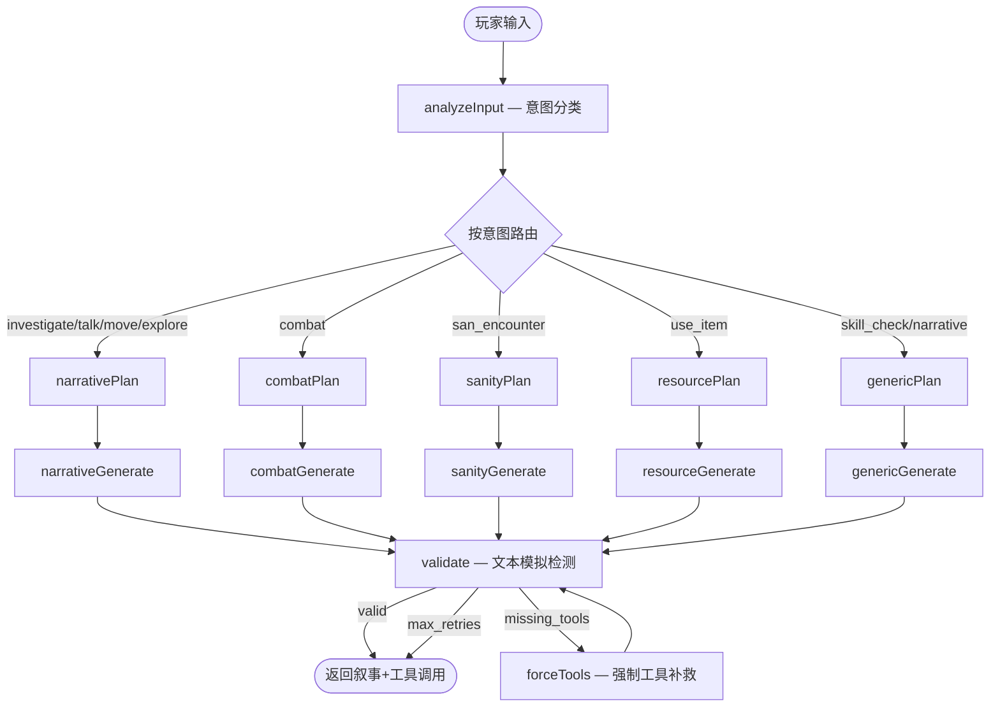

# AI-COC-KP 项目全面分析报告

> **分析日期**：2026-03-31  
> **分析范围**：完整代码库静态分析 + 测试运行 + Git 历史  
> **当前版本**：0.0.0（master 分支，共 11 次提交）

---

## 目录

1. [项目概述](#1-项目概述)
2. [技术栈与依赖](#2-技术栈与依赖)
3. [项目结构总览](#3-项目结构总览)
4. [架构深度分析](#4-架构深度分析)
5. [COC 7th 规则实现分析](#5-coc-7th-规则实现分析)
6. [AI 集成与 KP Agent 系统](#6-ai-集成与-kp-agent-系统)
7. [RAG 与知识检索系统](#7-rag-与知识检索系统)
8. [前端 UI 与用户流程](#8-前端-ui-与用户流程)
9. [状态管理与数据模型](#9-状态管理与数据模型)
10. [测试现状与覆盖率](#10-测试现状与覆盖率)
11. [代码质量评估](#11-代码质量评估)
12. [已知问题与技术债务](#12-已知问题与技术债务)
13. [开发路线图状态](#13-开发路线图状态)
14. [Git 历史与演进](#14-git-历史与演进)
15. [总结与建议](#15-总结与建议)

---

## 1. 项目概述

**AI-COC-KP** 是一款基于 **Vue 3 + Electron** 的单机桌面应用，实现 **克苏鲁的呼唤（Call of Cthulhu）第七版** 的 AI 守秘人（KP/Keeper）跑团体验。

### 核心定位

- **单机桌面应用**：Electron 包裹，无需后端服务器
- **AI 守秘人**：由 LLM 驱动的自动 KP，通过 LangGraph 多 Agent 工作流实现
- **规则严谨**：强制通过工具调用（Tool Calling）执行投骰与数值变更，防止 AI 在叙事中伪造
- **RAG 驱动**：支持导入剧本（PDF/Markdown/TXT），通过 TF-IDF + GraphRAG 检索故事情报

### 核心用户流程

```
首页 → 导入/选择剧本 → 选择职业 → 创建角色 → 进入游戏房间 → 与 AI KP 对话跑团
```

---

## 2. 技术栈与依赖

### 2.1 核心技术栈

| 层级 | 技术 | 版本 |
|------|------|------|
| 前端框架 | Vue 3 | ^3.5.25 |
| 状态管理 | Pinia | ^3.0.4 |
| 路由 | Vue Router | ^4.6.4 |
| 构建工具 | Vite | ^7.3.1 |
| 样式 | Tailwind CSS | ^3.4.19 |
| 语言 | TypeScript | ~5.9.3 |
| 桌面框架 | Electron | ^40.4.1 |
| AI SDK | OpenAI SDK | ^4.73.0 |
| Agent 框架 | LangChain/LangGraph | ^1.1.24 / ^1.1.4 |
| 测试 | Vitest | ^4.0.18 |
| E2E | Playwright | ^1.55.0 |

### 2.2 关键依赖说明

| 依赖 | 用途 |
|------|------|
| `@xenova/transformers` | 本地 embedding 模型（可选 dense embedding） |
| `electron-store` | 设置持久化存储 |
| `pdf-parse` / `pdf-lib` / `pdf-to-img` | PDF 剧本解析与 OCR |
| `tesseract.js` | PDF 内嵌图片 OCR |
| `sharp` | 图片处理（OCR 预处理） |
| `mammoth` | DOCX 文档解析 |
| `epub-parser` | EPUB 电子书解析 |

### 2.3 开发依赖亮点

- **ESLint 9** + Prettier + Vue/TS 插件已安装
- **electron-builder** 用于生产打包
- **concurrently** + **wait-on** 用于 Electron 开发模式同步启动
- **cross-env** 跨平台环境变量

---

## 3. 项目结构总览

### 3.1 文件统计

| 类别 | 数量 |
|------|------|
| Vue 组件/页面 | 9 个 (.vue) |
| TypeScript 源码 | 29 个 (.ts) |
| 测试文件 | 24 个 (.spec.ts) |
| Electron 主进程 | 25 个 (.cjs/.mjs/.js) |
| **总源码文件** | **约 87 个** |

### 3.2 目录职责

```
ai-trpg-web/
├── src/                          # 渲染进程（Vue SPA）
│   ├── views/          (6)       # 页面级组件
│   ├── components/     (4)       # 可复用组件（game/layout/ui）
│   ├── stores/         (3)       # Pinia 状态（game/settings/story）
│   ├── services/       (10)      # 业务服务层（AI/KP/RAG/骰子/存档等）
│   ├── toolCalling/    (9)       # 工具编排 + 5 类 Handler
│   ├── logic/          (5)       # COC 规则纯函数
│   ├── types/          (4)       # TypeScript 类型定义
│   ├── data/           (1)       # 静态数据（职业、技能表）
│   ├── composables/    (1)       # Vue 组合式函数
│   ├── router/         (1)       # 路由配置
│   └── utils/          (1)       # 工具函数
│
├── electron/                     # Electron 主进程（Node.js）
│   ├── agent/          (1)       # LangGraph KP 状态机
│   ├── ipc/            (8)       # IPC Handler（AI/KP/RAG/文件/存档/设置）
│   ├── rag/            (11)      # RAG 系统（向量/图谱/解析/Prompt）
│   └── integration/    (1)       # 冒烟测试
│
├── e2e/                          # E2E 测试
├── scripts/                      # 构建脚本
└── docs/                         # 项目文档
```

---

## 4. 架构深度分析

### 4.1 整体架构

```
┌───────────────────────────────────────────────────────────────────┐
│                    Renderer (Vue 3 SPA)                           │
│                                                                   │
│  Views → Components → Stores(Pinia) → Services → ToolCalling     │
│                                                                   │
│  路由: Hash(file://) / History(http://) 模式自动切换              │
└─────────────────────────┬─────────────────────────────────────────┘
                          │ IPC (contextBridge + preload)
┌─────────────────────────▼─────────────────────────────────────────┐
│                  Electron Main Process                             │
│                                                                   │
│  ┌─────────┐  ┌──────────────┐  ┌──────────────────────────────┐ │
│  │ Settings │  │ File/Save IO │  │ AI Layer                     │ │
│  │ Handler  │  │ Handler      │  │ ┌──────────┐ ┌────────────┐ │ │
│  └─────────┘  └──────────────┘  │ │ Direct   │ │ LangGraph  │ │ │
│                                  │ │ Chat     │ │ KP Agent   │ │ │
│  ┌───────────────────────────┐  │ └──────────┘ └────────────┘ │ │
│  │ RAG System                │  └──────────────────────────────┘ │
│  │ ┌─────────┐ ┌──────────┐ │                                   │
│  │ │ TF-IDF  │ │ GraphRAG │ │                                   │
│  │ │ Vector  │ │ (图谱+   │ │                                   │
│  │ │ Store   │ │  社区摘要)│ │                                   │
│  │ └─────────┘ └──────────┘ │                                   │
│  │ ┌──────────────────────┐ │                                   │
│  │ │ User Action Graph    │ │                                   │
│  │ │ (线索/场景/检定记录) │ │                                   │
│  │ └──────────────────────┘ │                                   │
│  └───────────────────────────┘                                   │
└───────────────────────────────────────────────────────────────────┘
```

### 4.2 安全边界

- **API Key 隔离**：所有 AI 密钥仅存于主进程，渲染进程通过 IPC 调用
- **contextIsolation**：Electron 启用上下文隔离，无 nodeIntegration
- **路径安全**：`pathSafety.cjs` 实现路径穿越防护
- **preload 白名单**：仅暴露有限 API 方法

### 4.3 数据流（一次玩家行动）

```
玩家输入 → gameStore.sendPlayerMessage()
  ├→ kpPromptService 构建 System Prompt（含规则指令 + RAG 上下文 + 记忆）
  ├→ ragService 检索剧本片段（topK=8）
  ├→ kpSessionService 发起 KP 调用
  │   ├→ [KP Agent 模式] kp:invokeStream → LangGraph 状态机
  │   │   ├→ analyzeInput（意图分类）
  │   │   ├→ routeByIntent → 对应 Plan/Generate Agent
  │   │   ├→ validate（文本模拟检测）
  │   │   └→ forceTools（补救，如需要）
  │   └→ [直连模式] ai:chat → 单次 LLM + 工具
  ├→ orchestrator.processToolCalls()
  │   └→ 路由到各 Handler（check/combat/sanity/resource/narrative）
  │       └→ 更新 characterSheet + 生成 DiceMessage
  └→ UI 更新（消息列表 + 状态栏 + 线索面板）
```

### 4.4 架构优点

1. **前后端边界清晰**：敏感操作完全在主进程
2. **工具系统可扩展**：新增工具只需添加 Handler + 注册
3. **双轨降级**：LangGraph Agent 失败时自动降级为直连 + 工具模式
4. **单一工具来源**：`sync-tools.cjs` 保证 `cocToolNames.json` ↔ 主进程 `COC_KP_TOOLS` ↔ 前端 Handlers 三端一致
5. **依赖注入**：`toolContextFactory` 将 store 更新注入工具，便于测试与复用

---

## 5. COC 7th 规则实现分析

### 5.1 已实现规则

| 规则领域 | 实现文件 | 覆盖内容 |
|----------|----------|----------|
| **技能检定** | `coc7Rules.ts` | 常规/困难/极难阈值、大成功(01)、大失败(96+/100) |
| **对抗检定** | `checkHandler.ts` | 双方骰点 + 成功等级对比 |
| **角色创建** | `coc7Character.ts` | 职业 9 点分配、兴趣 +20、属性骰、伤害加值/体格表、HP/MP/SAN 公式 |
| **近战/远程** | `combatHandler.ts` | 伤害表达式解析、护甲、奖励/惩罚骰 |
| **重伤/濒死** | `combatHandler.ts` | `apply_major_wound`、HP ≤ 0 判定 |
| **急救/医学** | `combatHandler.ts` | 成功急救 HP+1 解除濒死、医学 1D3 治疗 |
| **SAN 检定** | `sanityHandler.ts` | 成功/失败损失、临时/不定性/永久疯狂分支 |
| **疯狂触发** | `sanityHandler.ts` | `trigger_insanity`、每日 SAN 损失追踪 |
| **自然恢复** | `healingRules.ts` | 轻伤每日 +1 HP、重伤每周 CON 检定 +1D3 HP |
| **Max SAN** | `sanityHandler.ts` | 正向调整 clamp 到 `99 - cthulhuMythos` |
| **幸运消耗** | `resourceHandler.ts` | `spend_luck` 扣减幸运值 |
| **场景/线索** | `narrativeHandler.ts` | `transition_scene` + `grant_clue` |
| **骰子系统** | `diceService.ts` | D100/D20/任意面骰、奖励/惩罚骰 |

### 5.2 规则工具清单（17 个工具）

```
skill_check, opposed_check, roll_dice,
melee_attack, ranged_attack, adjust_hp, apply_major_wound, first_aid, medicine,
san_check, trigger_insanity, adjust_san, reset_day,
adjust_mp, spend_luck,
transition_scene, grant_clue
```

### 5.3 未实现规则（按 Sprint 规划）

| 规则 | 状态 | 所属 Sprint |
|------|------|-------------|
| 幕间技能成长（D100 > 技能值 → +1D10） | 占位函数已建 | Sprint 2 |
| 环境伤害表（坠落/火焰/溺水/毒素） | 占位函数已建 | Sprint 2 |
| 神话典籍（泛读/精读、CM 增长） | 未开始 | Sprint 3 |
| 施法检定（POW 检定、MP/SAN 消耗） | 未开始 | Sprint 3 |
| SAN 恢复（剧本奖励、心理治疗） | 未开始 | Sprint 3 |
| 追逐系统 | 未开始 | Sprint 4 |
| 先攻/战技 | 未开始 | Sprint 4 |
| 信用评级/经济 | 未开始 | Sprint 5+ |
| NPC 幸运池 | 未开始 | Sprint 5+ |
| 习惯恐惧（habituation） | 未开始 | Sprint 5+ |

---

## 6. AI 集成与 KP Agent 系统

### 6.1 双轨 AI 调用

系统提供两种 KP 模式，运行时自动选择：

**路径 1：LangGraph KP Agent（推荐）**



**路径 2：直连对话（降级）**
- 无 KP Agent API 时或 Agent 失败时启用
- 单次 LLM 调用 + 工具定义
- 通过 `kpSessionService.runDirectChat` 流式消费

### 6.2 意图分类与路由

| 意图 | 说明 | 路由 Agent |
|------|------|-----------|
| `investigate` | 搜索、侦查、检查 | narrative |
| `skill_check` | 明确技能检定 | generic |
| `talk_npc` | NPC 对话、说服 | narrative |
| `move` | 前往某处 | narrative |
| `combat` | 攻击、格斗、射击 | **combat** |
| `explore` | 探索、观察 | narrative |
| `use_item` | 使用道具 | **resource** |
| `san_encounter` | 恐怖/超自然 | **sanity** |
| `narrative` | 一般叙事 | narrative/generic |

### 6.3 KP Prompt 系统

`kpPromptService.ts` 构建的 System Prompt 包含：

- **角色定义**：守秘人身份与行为约束
- **规则指令**：禁止在正文编造骰子/HP/MP/SAN 变化，必须通过工具
- **RAG 情报边界**：仅基于剧本检索结果描述场景，防剧透
- **开场/回合 Prompt**：`buildOpeningPrompt` / `buildTurnPrompt`，注入多轮对话 + 记忆摘要

### 6.4 多 LLM 支持

预设 Provider：OpenAI、Anthropic、Google (Gemini)、DeepSeek、OpenRouter、vLLM、Ollama 等，均通过 OpenAI 兼容 API 对接。

### 6.5 验证与卫生机制

- **sanitizeKpResponse**：过滤 KP 回复中的内部提示行
- **validate 节点**：正则检测叙事中伪造的骰点/数值变更，触发 `forceTools` 补救
- **工具一致性校验**：`sync-tools.cjs` + `toolConsistency.spec.ts` 保证三端工具名一致

---

## 7. RAG 与知识检索系统

### 7.1 系统架构

```
剧本导入 → storyParsers 解析 → storyService 分块
                                      ↓
              ┌───────────────────────┼───────────────────────┐
              ↓                       ↓                       ↓
        TF-IDF 索引            Dense Embedding          GraphRAG 图谱
        (vectorStore)          (embedding.mjs)         (graphStore.mjs)
              ↓                       ↓                       ↓
              └───────────────────────┼───────────────────────┘
                                      ↓
                              RAG 检索管道
                          (向量检索 → 图扩展 → 摘要)
                                      ↓
                            注入 KP System Prompt
```

### 7.2 支持的文档格式

- **PDF**：`pdf-parse` 解析 + `pdf-to-img` + `tesseract.js` OCR 内嵌图
- **Markdown / TXT**：直接文本分块
- **DOCX**：`mammoth` 解析
- **EPUB**：`epub-parser` 解析

### 7.3 三层检索

| 层级 | 模块 | 说明 |
|------|------|------|
| **TF-IDF** | `vectorStore.mjs` | 基础关键词检索，无需 embedding 模型 |
| **Dense Embedding** | `embedding.mjs` | 可选，使用 `@xenova/transformers` 本地模型或 API |
| **GraphRAG** | `graphRag.mjs` + `graphStore.mjs` | 实体/关系知识图谱 → 2-hop 图扩展 → 社区摘要 |

### 7.4 GraphRAG 特色

- **COC 定制 Prompt**：`prompts/` 目录下的 `cocExtractGraph.js`、`cocCommunityReport.js` 等针对 COC 剧本的实体/关系/社区摘要
- **用户行动图谱**：`userGraphStore.mjs` 记录玩家获得的线索、到访场景、检定结果，与 RAG 上下文一并注入

---

## 8. 前端 UI 与用户流程

### 8.1 页面路由

| 路径 | 视图 | 说明 |
|------|------|------|
| `/` | `HomeView.vue` | 首页入口 |
| `/scripts` | `ScriptListView.vue` | 剧本列表（导入/删除/索引） |
| `/occupation` | `OccupationSelectView.vue` | COC7 职业选择 |
| `/character-create` | `CharacterCreateView.vue` | 角色创建（属性骰/技能分配） |
| `/game` | `GameRoomView.vue` | 游戏房间（受路由守卫保护） |
| `/settings` | `SettingsView.vue` | AI/RAG 配置 |

### 8.2 路由守卫

- `/game` 路由设置 `meta.requiresGame`
- `beforeEach` 校验 `gamePhase === 'playing'` 且 `characterSheet` 存在
- 不满足则重定向至 `/`

### 8.3 组件结构

```
AppLayout.vue              # 全局布局壳
├── 各 View                # 页面内容
├── game/
│   ├── ChatMessage.vue    # 消息气泡（KP/玩家/系统/骰子）
│   └── PlayerStatsBar.vue # 角色状态栏（HP/MP/SAN/Luck 等）
└── ui/
    └── ToastContainer.vue # 全局 Toast 提示
```

### 8.4 样式方案

- **Tailwind CSS 3**：主要样式方案
- **全局组件类**：`style.css` 中定义 `.gothic-card`、`.gothic-btn` 等哥特风格组件类
- **暗色主题**：`@layer base` 中实现 dark 模式与自定义滚动条
- 无 CSS Modules 或 styled-components

---

## 9. 状态管理与数据模型

### 9.1 Pinia Stores

| Store | 职责 |
|-------|------|
| **gameStore** | 会话 ID、故事 ID、场景、线索、消息列表、角色卡、KP 记忆、长期摘要、游戏阶段；核心行为：`sendPlayerMessage`、`requestOpening`、`processToolCalls`、存档读写 |
| **settingsStore** | AI Provider / Base URL / API Key / Model / RAG 开关；`load()` / `save()` 通过 IPC |
| **storyStore** | 故事文件列表、导入/删除、RAG 索引（单故事/全部） |

### 9.2 核心类型定义

**`COCCharacterSheet`**（character.ts）：
- 属性：STR/CON/SIZ/DEX/APP/INT/POW/EDU/LUCK
- 衍生值：HP/MP/SAN/MOV、伤害加值/体格
- 技能映射表、武器列表
- 疯狂状态、每日 SAN 损失追踪
- 重伤/濒死标记
- `cthulhuMythos`（未来用于 Max SAN）

**消息类型**（game.ts）：
- `KPMessage`：守秘人消息
- `PlayerMessage`：玩家消息
- `SystemMessage`：系统提示
- `DiceMessage`：骰子/检定结果（含详细结果数据）

**工具上下文**（toolCalling/types.ts）：
- `ToolHandler`：`(toolName, args, context) => ToolResult`
- `ToolHandlerContext`：角色卡读写、骰子服务、HP/MP/SAN/场景/线索更新函数

**存档模型**（saveService.ts）：
- `GameSaveSnapshot`：完整游戏状态快照
- `SAVE_VERSION`：版本迁移支持

### 9.3 记忆系统

- **短期记忆**：`kpMemory` 数组（最近 N 条对话摘要），`MAX_MEMORY_ENTRIES=12`
- **长期摘要**：`memoryService.summarizeLongTerm` 用 LLM 合并近期对话 + 旧摘要
- **触发时机**：场景切换时 `runLongTermSummarization`

---

## 10. 测试现状与覆盖率

### 10.1 测试运行结果（2026-03-31）

```
✅ 24 test files passed
✅ 137 tests passed
⏱  Duration: 17.60s
```

### 10.2 测试分布

| 测试域 | 文件数 | 用例数 | 说明 |
|--------|--------|--------|------|
| **COC 规则** | 3 | 34 | coc7Rules(14) + coc7Character(19) + healingRules(4) |
| **工具 Handler** | 5 | 44 | check(9) + combat(8) + sanity(17) + resource(5) + narrative(5) |
| **编排器** | 2 | 5 | orchestrator(4) + toolConsistency(1) |
| **服务层** | 3 | 19 | diceService(7) + kpSessionService(9) + memoryService(3) |
| **Store** | 1 | 2 | gameStoreMemory(2) |
| **Electron/RAG** | 7 | 20 | embedding(3) + vectorStore(4) + graphExtract(3) + storyParsers(5) + kpGraph(2) + logging(1) + pathSafety(5) |
| **占位** | 3 | 3 | environmentRules(1) + growthRules(1) + healingHandler(5) |

### 10.3 测试特点

- **工具同步校验**：`toolConsistency.spec.ts` 确保前后端工具名一致
- **Mock 设计**：`mockContext.ts` 提供标准化的测试上下文
- **纯函数优先**：规则逻辑与工具 Handler 高度可测
- **IPC Mock**：kpSessionService 测试通过 mock `electronAPI` 实现
- **E2E 框架就绪**：`electron.e2e.mjs` + Playwright 已配置

### 10.4 测试缺口

- View 组件无测试（Vue 组件测试）
- Store 集成测试较少（仅 1 个文件 2 个用例）
- E2E 流程测试未覆盖完整用户旅程

---

## 11. 代码质量评估

### 11.1 评分总览

| 维度 | 评分 | 说明 |
|------|------|------|
| 功能完整性 | ⭐⭐⭐⭐ | 核心跑团流程闭环，Sprint 1 已完成 |
| 架构清晰度 | ⭐⭐⭐⭐⭐ | 分层清晰、安全设计合理、职责分明 |
| 代码结构 | ⭐⭐⭐⭐ | 模块划分合理，类型系统完善 |
| 代码质量 | ⭐⭐⭐⭐ | TS 使用到位，命名规范，注释适度 |
| 测试覆盖 | ⭐⭐⭐ | 核心逻辑覆盖良好，UI/集成层偏弱 |
| 可维护性 | ⭐⭐⭐⭐ | 工具系统易扩展，kpSessionService 已拆出 |
| 文档 | ⭐⭐⭐ | README 详尽，内部注释适中 |

### 11.2 优点

1. **类型安全**：前端全面 TypeScript，`env.d.ts` 完整声明 ElectronAPI
2. **纯函数设计**：`logic/` 目录完全无副作用，极易测试
3. **依赖注入模式**：`toolContextFactory` 解耦工具与 store
4. **防御性编程**：路由守卫 + GameRoomView onMounted 双重校验
5. **AI 约束设计**：多层防护确保 KP 不在叙事中伪造数值

### 11.3 待改进

1. **主进程无类型**：`electron/` 下全为 .cjs/.mjs，无 TypeScript 类型标注
2. **错误分类不足**：错误处理缺少网络/模型/限流的差异化策略
3. **orchestrator 错误信息**：tool 执行失败时仅返回 `content: 'error'`，缺少原因
4. **GameRoomView 体积**：可进一步拆分子组件（线索列表、场景标签等）

---

## 12. 已知问题与技术债务

### 12.1 潜在 Bug

| 问题 | 严重度 | 说明 |
|------|--------|------|
| `MAX_MEMORY_ENTRIES` 引用 | 中 | `gameStore.ts` 中使用 `MAX_MEMORY_ENTRIES` 截断记忆，但该常量定义在 `kpPromptService.ts` 内部，如未正确导入可能导致运行时 `ReferenceError` |
| `resolveSkillCheck` 难度档位 | 低 | 判定极难/困难/常规成功时的档位区分逻辑需对照规则书再验证 |

### 12.2 技术债务

| 项目 | 优先级 | 说明 |
|------|--------|------|
| 工具定义双写 | 高 | `aiHandlers.cjs` 的 `COC_KP_TOOLS` 与前端 handlers 需手动同步，已有 `sync-tools` 缓解 |
| 主进程类型化 | 中 | electron/ 目录全为无类型的 CJS/MJS |
| coverage 提交 | 低 | `ai-trpg-web/coverage/` 目录被提交到 git，应加入 .gitignore |
| 长期摘要错误吞噬 | 中 | `runLongTermSummarization` 的 `.catch(() => {})` 静默吞掉错误 |

### 12.3 CRLF 问题

- 大量文件存在 LF/CRLF 不一致（git diff 报 warning）
- 建议配置 `.gitattributes` 统一行尾

---

## 13. 开发路线图状态

### Sprint 进度

| Sprint | 主题 | 状态 |
|--------|------|------|
| **Sprint 1** | 治疗与 Max SAN（急救/医学/自然恢复/Max SAN clamp） | ✅ 已完成 |
| **Sprint 2** | 幕间成长与环境伤害 | 🔲 占位函数已建 |
| **Sprint 3** | 魔法系统与 SAN 恢复 | 🔲 未开始 |
| **Sprint 4** | 追逐系统与先攻/战技 | 🔲 未开始 |
| **Sprint 5+** | 经济、NPC 幸运池、习惯恐惧 | 🔲 未开始 |

### 基础设施完成度

| 能力 | 状态 |
|------|------|
| Vue 3 + Electron 桌面应用 | ✅ |
| LangGraph 多 Agent KP | ✅ |
| 工具调用 + 17 个 COC 工具 | ✅ |
| TF-IDF RAG | ✅ |
| GraphRAG（实体/关系/社区摘要） | ✅ |
| 用户行动图谱 | ✅ |
| PDF/Markdown/DOCX/EPUB 导入 | ✅ |
| PDF OCR | ✅ |
| 存档/读档系统 | ✅ |
| 长期记忆摘要 | ✅ |
| 单元测试框架 + 137 用例 | ✅ |
| E2E 测试框架 | ✅（框架就绪，用例少） |

---

## 14. Git 历史与演进

### 14.1 提交历史（时间倒序）

| # | Hash | 描述 | 关键变更 |
|---|------|------|----------|
| 11 | `c7d4196` | 清理 TF-IDF RAG | RAG 优化 |
| 10 | `bf0e491` | 添加 GraphRAG 系统 | 关系抽取 + 记忆管理 |
| 9 | `fac74a4` | 小改动 | 修补 |
| 8 | `0999cf1` | 添加 README | 项目文档 |
| 7 | `b39b7c1` | 完成 Phase 1 + Code Review | 代码审查 + 后续规划 |
| 6 | `18b176a` | 重构多 Agent + 记忆/RAG 集成 | 架构升级 |
| 5 | `2fe185b` | P0 功能 + 测试代码 | 核心功能完善 |
| 4 | `eaa1eb3` | 重构 + Bug 修复 + 新功能追踪 | 稳定性 |
| 3 | `879029b` | 修复属性概率错误 | Bug 修复 |
| 2 | `95bf003` | 添加 COC 故事和剧本 | 内容 |
| 1 | `50005e3` | 添加 RAG 服务 + 创建仓库 | 初始化 |

### 14.2 分支状态

- **唯一分支**：`master`
- **远程**：`origin/master`
- **未提交变更**：6 个 docs 文件已删除（本地删除，未 commit）

---

## 15. 总结与建议

### 15.1 项目健康度总评

**项目整体处于良好的开发状态**，核心架构扎实、规则实现严谨、AI 集成完善。Sprint 1 已完成，基础设施成熟度高。

### 15.2 恢复开发建议（优先级排序）

#### P0 — 立即处理

1. **验证 `MAX_MEMORY_ENTRIES` 引用**：确认 `gameStore.ts` 中是否正确导入该常量
2. **处理 docs 删除**：确认是有意删除还是误操作，决定是否恢复
3. **将 `coverage/` 加入 .gitignore**

#### P1 — 近期改进

4. **启动 Sprint 2**：幕间成长 + 环境伤害（占位函数已就位）
5. **增强错误处理**：按错误类型（网络/模型/限流）做差异化提示与重试
6. **拆分 GameRoomView**：将线索面板、场景信息等抽为子组件

#### P2 — 中期优化

7. **主进程类型化**：为 `electron/` 目录引入 JSDoc 或逐步迁移 TypeScript
8. **补充组件测试**：View 层 + Store 集成测试
9. **配置 `.gitattributes`** 统一行尾
10. **增加 `npm run lint`** 并确保提交前执行

#### P3 — 长期演进

11. **按路线图推进 Sprint 3~5**：魔法→追逐→经济
12. **性能优化**：消息列表虚拟滚动、RAG 检索延迟 profiling
13. **多语言/a11y**：如有国际化需求，预留 i18n 结构

---

> 本文档由代码库静态分析自动生成，如有遗漏请结合源码验证。
